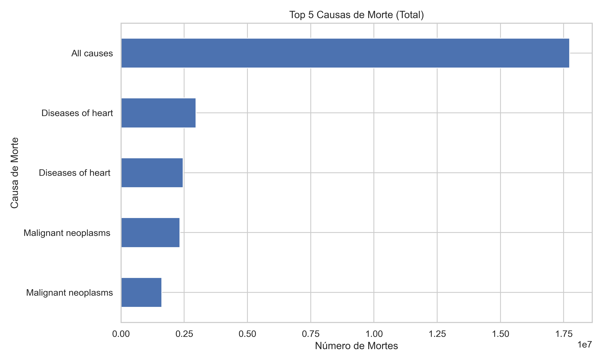

# Leading Causes of Death Analysis

Este projeto apresenta uma análise exploratória das **principais causas de morte nos Estados Unidos**, usando dados abertos do [CDC](https://www.cdc.gov/nchs/hus.htm). A análise inclui tendências históricas, crescimento percentual, comparações por sexo e raça, e previsões de mortes futuras usando regressão linear.

## 📂 Dataset

- Fonte: Kaggle – [Leading causes of death and numbers of deaths](https://www.kaggle.com/datasets/cdc/leading-causes-of-death-and-numbers-of-deaths)
- Formato: CSV
- Período: 1980 a 2009
- Principais colunas:
  - `year` – Ano
  - `group` – Grupo demográfico (sexo, raça)
  - `cause_of_death` – Causa da morte
  - `deaths` – Número de mortes

## 📊 Objetivos da Análise

1. Identificar as **principais causas de morte** e suas tendências ao longo do tempo.
2. Calcular o **percentual de crescimento anual** das mortes por causa.
3. Aplicar **regressão linear** para prever mortes futuras.
4. Comparar causas de morte por **sexo** e **grupo racial**.
5. Visualizar tendências de mortalidade para **top 5 causas**.

## 🛠️ Ferramentas e Bibliotecas

- Python 3.x
- Pandas
- NumPy
- Matplotlib
- Seaborn
- Scikit-Learn

## 📈 Principais Análises e Gráficos

- **Top 5 causas de morte**: barras horizontais mostrando total de mortes.

- **Percentual de crescimento anual**: linha mostrando variação percentual ano a ano.
- **Previsão com regressão linear**: histórico e projeção para anos futuros.
- **Comparação por sexo e raça**: barras/linhas para entender diferenças demográficas.
- **Tendências históricas**: evolução das principais causas ao longo do tempo.

## 🖼️ Imagens / Gráficos
1. **Top 5 causas de morte** – gráfico de barras horizontais.  
2. **Percentual de crescimento anual das top 5 causas** – gráfico de linhas.  
3. **Previsão de mortes futuras** (regressão linear) – gráfico de linhas com histórico e previsão.  
4. **Comparação por raça/sexo** – gráfico de barras ou linhas mostrando disparidades.  

## 🔍 Insights

- As principais causas de morte incluem: **Doenças cardíacas, Neoplasias malignas, Acidentes, Doenças respiratórias crônicas e AVC**.  
- Algumas causas, como **Homicídios**, mostram crescimento ou variações significativas em determinados grupos demográficos.  
- Diferenças marcantes de mortalidade por **sexo e raça**, evidenciando disparidades sociais e de saúde.  

## 💡 Próximos Passos

- Adicionar análise por faixa etária (quando disponível).  
- Criar **dashboard interativo** com Plotly ou Streamlit.  
- Incluir **modelos de previsão mais avançados**, como ARIMA ou Prophet.

---

> Projeto desenvolvido como portfólio de **Análise de Dados**.
